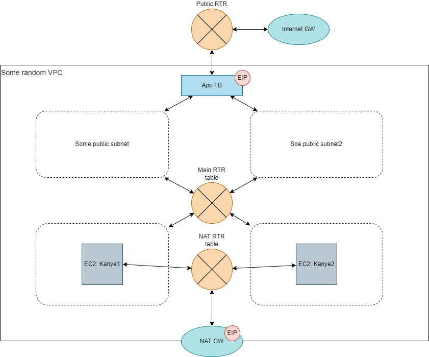

# Junior SRE interview terraform example

## Overview

The terrafrom within this repo creates a aws vpc with four subnets, two private and two public. Two ec2 instances are produced and sit on the private subnets with no public ip address aswell as a script to produce a web page with a kanye quote. In additon a internet gate way, nat gateway and a load balancer are created. The load balancer and nat gate way sit on the public subnets. 
The load balancer has two listeners on ports 80 and 443 for https traffic and a redirect on http traffic. The loadbalancer targets the ec2 instance through the internal routing table on http. The load balancer is accessed by the internet via the internet gate way and is routed via the public routing table.
The script on the ec2 requires an internet connection on start up in order to curl the kanye quotes and therefore a route is setup from the private subnets to the nat gate way. 
Regarding the certifacte for the ALB, the terraform requests a certifcate and fills out the required route 53 records with the dns record of the load balancer after the validation of the certifcate is confirmed.
Security groups for the ec2s are also created to only allow ip addresses from within the vpc whereas the loadbalancer securtiy group allows for access from all IPs (Internet access).

# To use:
    - Ensure AWS API keys have been exported
    - export ENVIRONMENT=dev

# Topology Diagram

